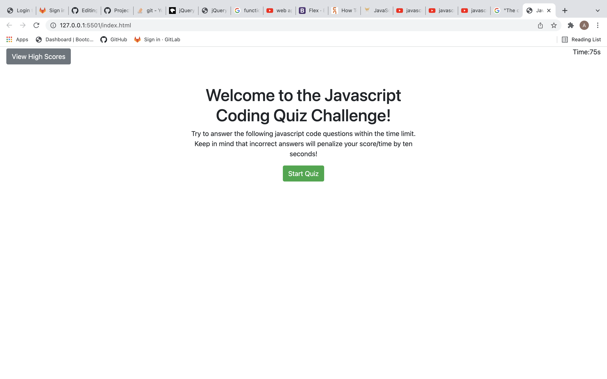
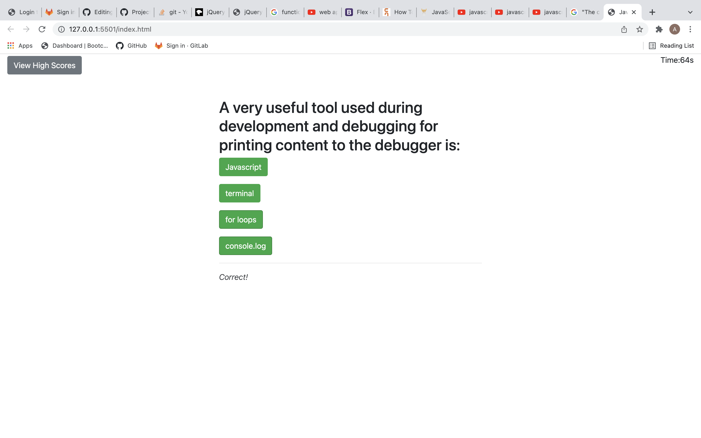

# Js-code-quiz

Project's Title: Js-code-quiz

Project Description: This project is a culmination of all the programming i learned so far. I used HTML, CSS, Javascript, and JQuery to make a quiz app that tracks your scores, deducts time for wrong answers and saves your scores on a leaderboard! the code is very easy to read and everyone can follow along. I plan on modifying this app to make it look even better soon so keep an eye out!

Screenshots of App:

Links to website:

